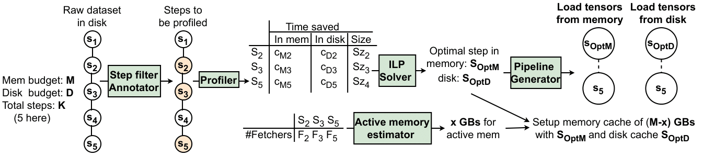

# Introduction
This repository contains the source code implementation of the Conference'25 paper "HyCache: Hybrid Caching for Accelerating DNN Training
Input Pipelines". This work was done as part of my thesis project in my Masters at IISc, Bangalore. This source code is available under the MIT License.

We present an automated tool, HyCache, a novel hybrid caching mechanism designed to accelerate DNN training pipelines. We demonstrate its effectiveness through comprehensive evaluation and comparison with existing approaches. Hycace leverages both memory and storage for caching, orchestrating the usage of these resources automatically, showing a significantly reduced data preprocessing time, thereby addressing the bottleneck in DNN training input pipelines. Our experiments have validated that HyCache can achieve substantial performance improvements, with gains ranging from 1.11× to 5.3× over traditional preprocessing pipelines. The implementation of HyCache is simple and open-sourced, hence can be adopted to other preprocessing frameworks.

[[pdf]]()  [[slides]]()

# Usage
```python3
HyCache(pipeline, dataset, memory_budget, disk_budget, cache_steps, disk_cloc, logdir, batch_size,
    profile_factor, threads, rank, world_size, directio, merge)
```
<!-- - A class that takes an nvidia.dali.Pipeline object, a user-provided mem_budget, disk_budget (in GBs), and max_cpu's to limit pipeline process allocation. If not provided, `memory_budget` is assumed to be the size of available memory. `disk_budget` needs a `disk_loc` parameter that specifies the location of the disk cache (Disabled by default).   -->

- A class that takes an nvidia.dali.Pipeline object, amongst other useful arguments. This is the entry point into the library, and the class returns the optimized iterator for preprocessing upon calling `.build()` on the class object.


This is how you would typically write a Preprocessing pipeline to leverage HyCache:
```python3
class Preprocesser(BasePipeline):
    def __init__(
        self, batch_size, num_threads, num_workers, device_id, prefetch_depth=2, samples=[]):
        super(Preprocesser, self).__init__(
            batch_size,
            num_threads,
            device_id,
            seed=12,
            prefetch_queue_depth=prefetch_depth,
            py_start_method='spawn',
            py_num_workers=num_workers,
            enable_memory_stats=True,
        )
        
        ...

    def define_graph(self):
        rng = fn.random.coin_flip(probability=0.5)
        # Fetch step
        images, labels, sample_idx = fn.external_source(
            source=self.input,num_outputs=3,batch=False,parallel=True,dtype=[types.FLOAT, types.INT32, types.INT32])
        
        # Step 1
        images = fn.decoders.image(fn.cast(images, dtype=types.UINT8), device="cpu")

        # Step 2
        images = fn.resize(
            images, device=self.device_id, resize_x=224, resize_y=224, interp_type=types.INTERP_TRIANGULAR)

        # Step 3
        images = fn.crop_mirror_normalize(
            images,mean=[0.485, 0.456, 0.406], std=[0.229, 0.224, 0.225], dtype=types.FLOAT)

        # Step 4
        images = fn.flip(fn.cast(images, dtype=types.UINT8), horizontal=rng)
    
        return [images, labels, sample_idx]
```
There are some modifications to the regular DALI Pipeline class definition:
- The parent class is not `nvidia.dali.Pipeline` anymore, it would be `shc_lib.pipeline.BasePipeline`
- The user needs to use `fn.external_source` and `self.input` as the internal function, which we define internally.
- It is advised to generally nest the cast operation inside the main preprocesser function, to make it a singular step, easing the profiling process.

## An example of how to use HyCache in your DNN training code:
```python3
from hcLib import BasePipeline, HyCache

class Preprocesser(BasePipeline)
    ...

opt_pipe_iter = HyCache(Preprocessor , ...).build()

for batch in opt_pipe_iter:
    ...
```
# Implementation:
Hycache is implemented in 5 basic blocks, explained in the figure below:



Details about each specific block is present in their respective submodules:

- [Annotater](annotate/annotate.md)
- [Profiler](profiler/profiler.md)
- [ILP Solver](solver/solver.md) 
- [Active Memory Estimator](memory_estimator/estimator.md)
- [Pipeline Generator](pipegen/pipegen.md) 

# Installation
You can simply use PyPi for insllation, or use the repository to build and install manually
## PyPi installation 
Simply run the following command and it'll install the package and its dependancies automatically
```
pip3 install hcLib
```

## Local installation
To install and setup HyCache locally, we recommend using a virtual environment:
```
python3 -m venv <virtualenv_name>
source <virtualenv_name>/bin/activate
```
### Clone the Github repository
```
git clone https://github.com/keshavvinayak01/hcLib
```

### Locally install the `hcLib` package
`cd` into the git folder, and run
```
python3 setup.py bdist_wheel
pip install dist/hcLib-0.1.0-py3-none-any.whl
```
OR
```
pip install .
```
<!-- # Profiling
Initialized by the `.profile()` method of the provided `HyCachePipe` class. Profiling is done for selection of cache steps on the memory, on the disk, and to scale the number of fetchers (Python processes used for fetching data from disk).

## **Memory**

### **Cache Budget**

To determine the *optimal* caching step(s), there needs to be some profiling that provides data about each step, namely, the compute saving per step if it's chosen to cache and the size of the materialized results to be cached. The dataset subset that is used for profiling would vary given the time constraint. The collected data is a python dictionary, for example:

```json
{
    "0": [0.47, 0.42],
    "1": [0.58, 1.92],
    "2": [0.28, 4.63],
    "3": [0.57, 5.12]

}
```
The key represents a **caching step** and the value is a tuple. The first value of the tuple is the average **size** of a tensor in that step, denoted in MBs. The second value denotes the average **compute saving** per tensor in that step in milliseconds.

The amount of time this profiling would take depends on the pipeline, dataset size, and the time_limit (if provided).

### **Active Memory Calculation** *[\*Needs more work]*
The amount of extra memory used by a fetching process is profile-able (varies for a pipeline), and scales linearly per added process.
Hence, by some minimal profiling, it is possible to obtain the per-process value and predict an upper bound on the memory required for a given number of fetching processes.

We observed that the active working memory is varying based on the type of pipeline. (Dataset, pre-processing step, cache type)
But it is consistent per added fetching process for the same pipeline.

For example:
- The used memory for 4 workers comes out to be 9000MB, and it comes out to be 9800MB for 8 workers.
- Hence, memory used per extra worker is 200MBs.
- Active memory used with 0 workers(Only main process fetches) is 8200MB (profiled).
- Therefore, for 16 workers, the active memory required would be: 8200 + 16*200 == 11400MB. (Verified empirically)

## **Disk**:
As of now, we follow the guidelines of **PRESTO (SIGMOD '22)** to decide what gets stored on the disk. We use the `fio` and `iostat` utility to determine the maximum achievable disk bandwidth (with *O_DIRECT* enabled). In our setup, it is generally the compute that stalls more than the fetch itself, hence *O_DIRECT* reads do not slow the pipeline down. This might change depending on the storage device. 

For the current iteration, we're using the same profiled data as explained in the **Cache Budget** section, guided by the I/O Bandwidth that is additionally measured. 


## **Workers**
To approximate the number of workers that would **saturate the fetch rate**, we use a simple logarithmic time algorithm.
We keep doubling the number of workers until the difference in fetch rate is less than `20 batches/s` (Tunable). The algorithm looks something like this:

```python3
num_workers = 1
AVAILABLE_CPU = 32 # Depends on hardware
CUTOFF = PROFILE_TIME / (int(log2(AVAILABLE_CPU)) + 1)
READ_THROUGHPUT = -1
PREV_GBPR = -1

while num_workers < AVAILABLE_CPU:
    begin = time.time()
    pipe = HyCache(
        ...
        py_num_workers=num_workers,
        steps=0
        ...
    )

    for i, batch in enumerate(pipe):
        ...
        if(batch % 20 and time.time() - begin >= CUTOFF):
            break
    READ_THROUGHPUT = i / CUTOFF
    if(READ_THROUGHPUT - PREV_GBPR <= 20)
        break
    PREV_GBPR = READ_THROUGHPUT
    num_workers *= 2
```

- PROFILE_TIME is provided by the end-user or is constrained to 10s per `num_workers`.

- The pipeline is launched by the num_workers as tuned. `steps=0` indicates that only the fetch operation will be performed, without any further preprocessing steps.

- Time is measured every 20 batches (Tunable).

- The above code segment cuts off the pipeline when we reach saturation in disk throughput , hence selecting the maximum achievable `READ_THROUGHPUT` and `N_CPUS` required for the current pipeline. This needs to be done per pipeline as the dataset item sizes and types varies for different datasets.

# Resource allocation design
## **Memory Cache**

The memory cache is application-controlled, and uses the shared-memory region (/dev/shm) with numpy arrrays to store the pre-processed data. Given a memory budget, we use an ILP to decide the caching step(s) that can provide the most speedup to the pipeline.

We use the data provided by memory-profiling (As highlighted in the above section) to feed into the ILP and generate a caching solution.


## **Disk Cache**

With the disk bandwidth value, fetch size of different datasets, the number of fetching processes, and the compute penalties associated with different steps, we are able to approximate which step would be optimal for caching and fetching from disk in pipeline performance. The decision function looks like this:

```python3
throughput = READ_THROUGHPUT / N_CPUS
throughput = min(throughput*fetchers, throughput*N_CPUS) # More workers than N_CPUs cannot increase throughput
fetch_time = (item_sizes[x] / throughput) / nbatches
pp_time = compute_times[x] / nbatches
total_time = (fetch_time + pp_time) + max(fetch_time, pp_time) * (nbatches-1)
```
- The `READ_THROUGHPUT` and `N_CPUS` variable is provided by `workers` profiling (Explained in previous section). 

- The fetch time and preprocessing time are for the entire pipeline run, hence are scaled down to per batch for expected total time calculation.

- `item_sizes` and `compute_times` are scaled down to the dataset size remaining after caching in memory. For example, in a dataset of 100GBs, if 20GBs are cached in the memory, then only 80GBs needs to be considered to be cached in disk.

- We use O_DIRECT to acces disk data, by passing the page-cache and not overshooting the given memory budget.

- While these calculations are approximate, we observed the output decision is the most optimal one, as PRESTO would recommend.

## **Workers/Fetchers Allocation** *[\*Needs more work]*

- The number of workers assigned diretly increases the fetch rate of datapoints from the disk, *but not memory*.

- These need to be assigned to a pipeline that is either entirely uncached or contains the disk-cache.

- Since the number of assigned workers also impact the total memory used, we need to measure the estimated speedup of using more cache vs using more fetching workers.

- Given 100GBs total budget for speeding up the pipeline, we need to approximate how much of that cache memory can be traded off for worker memory.
    - Given memory associated with each extra worker(say x`MB`), fetch and compute times of the pipelines, we can calculate speedup per added x`MB`.
    - Speedup per x`MB` of using cache can be easily approximated, as we already have the savings associated with a tensor.

- Given these two metrics, we can select which is the more performance optimal worker allocation. -->